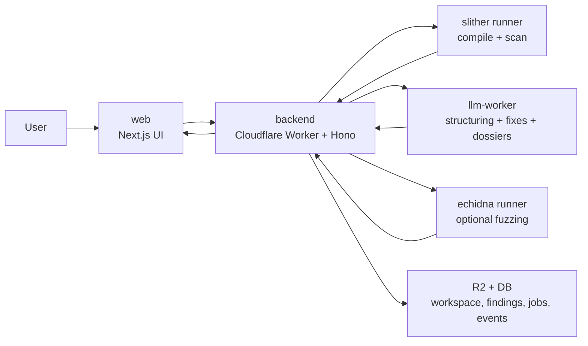
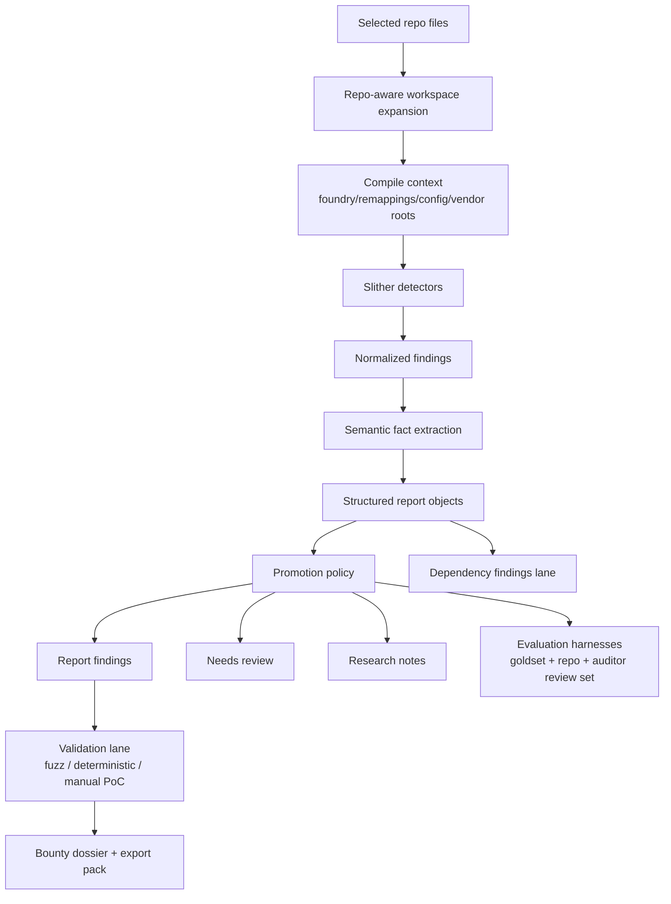

# Sentinel Audit

Sentinel Audit is a productized smart-contract audit workflow.

It is not just "run Slither and summarize it." The system is designed to:

- assemble a compilable workspace from selected repo files
- run static analysis against that workspace
- structure findings into report-ready objects
- carry bounty scope into triage, validation, and dossier generation
- separate first-party findings from dependency risk
- keep lower-signal output in research lanes instead of promoting everything
- support validation workflows instead of stopping at scanner output

The current product direction is captured in [ROADMAP.md](D:/projects/audit/apps/ROADMAP.md).

## Public Structure

SentinelAudit is being prepared for a selective public release.

The near-term plan is:

- publish reusable tooling and method-heavy pieces first
- keep billing, auth, customer data paths, and internal intelligence flows private
- avoid breaking the current product control plane while opening modules intentionally

See:

- [PUBLIC_RELEASE_BOUNDARY.md](D:/projects/audit/apps/docs/PUBLIC_RELEASE_BOUNDARY.md)
- [OSS_MODULES.md](D:/projects/audit/apps/OSS_MODULES.md)
- [PUBLIC_RELEASE_CHECKLIST.md](D:/projects/audit/apps/PUBLIC_RELEASE_CHECKLIST.md)
- [CONTRIBUTING.md](D:/projects/audit/apps/CONTRIBUTING.md)
- [SECURITY.md](D:/projects/audit/apps/SECURITY.md)

Before publishing any slice of the repo, run:

```bash
bun run audit:public-surface
```

## Architecture



## Audit Model



## Scope Philosophy

Sentinel now distinguishes between:

- first-party findings: issues in the user's project code
- dependency findings: vendored or third-party code such as `lib/`, `vendor/`, `node_modules/`, and package imports
- research notes: lower-signal output kept for manual review

Dependencies are still analyzed when needed for compilation and context, but
they should not dominate the main report verdict by default.

## Trust Model

Sentinel is now built around a stricter promotion rule:

- detector output is not enough
- semantic facts come first
- promotion policy decides whether something becomes:
  - `report_finding`
  - `needs_review`
  - `research_note`

The core questions Sentinel tries to answer automatically are:

- who can call this path
- what protection exists
- who controls the dangerous argument
- whether state is finalized before external interaction
- whether the affected code is first-party or dependency code

If those answers are weak or incomplete, Sentinel should hold the finding back
instead of pretending to have higher confidence than it does.

## Services

Typical local services:

- `web` at `http://localhost:3000`
- `backend` at `http://localhost:8787`
- `workers/llm-worker` at `http://localhost:8788`
- `api/slither` at `http://localhost:8080`

## One-Time Setup

1. Install dependencies:

```bash
cd web && bun install
cd ../backend && bun install
cd ../workers/llm-worker && bun install
cd ../..
```

2. Prepare env files:

- `web/.env.local`
  - set `NEXT_PUBLIC_API_URL=http://localhost:8787`
- `backend/.dev.vars`
  - local backend worker config
- `workers/llm-worker/.dev.vars`
  - copy from `workers/llm-worker/.dev.vars.example`

3. Make sure Docker Desktop is running for Slither.

## Local Run

From [D:\projects\audit\apps](D:/projects/audit/apps):

```bash
bun run dev:slither
bun run dev:echidna
bun run dev:llm
bun run dev:backend
bun run dev:web
```

## Local Verification

```bash
bun run check:local
```

This currently verifies:

- web TypeScript compiles
- backend test suite passes
- `llm-worker` local-safe tests pass

## Important Local Notes

- local report structuring happens after a job reaches `READY`, not when the report page refreshes
- local backend should use `LLM_WORKER_URL=http://127.0.0.1:8788`
- backend and `llm-worker` must share the same `LLM_WORKER_TOKEN`
- local backend sends inline findings to the local worker because Wrangler's simulated local R2 is not shared across services
- `backend/.dev.vars` should point `SLITHER_RUNNER_URL` at `http://localhost:8080`

## What AI Is Responsible For

AI is used as a constrained layer on top of deterministic inputs.

Good uses:

- structuring normalized findings
- exploitability-oriented triage
- fix generation
- bounty dossier generation
- Echidna harness planning/generation
- proof-plan generation for deterministic tests and manual PoCs
- deterministic test generation and execution with repo-aware Foundry/Hardhat selection

Bad uses:

- inventing vulnerabilities from raw detector output
- promoting dependency noise into first-party findings
- acting like a one-click replacement for human audit judgment

## What Still Matters Most

The next serious quality leap is not "more AI."

It is automatic repo-local semantic extraction and stronger promotion policy:

- who can call this
- what protects it
- what input is attacker-controlled
- what state changes before and after sensitive calls
- whether the code is first-party or vendored

That is the path from "AI-assisted scanner" to "real audit triage system."

## Validation Model

Sentinel now treats validation as a first-class lane after findings are
structured.

- `fuzz_target`
  - suitable for Echidna harness generation and counterexample hunting
- `deterministic_test`
  - better validated through a crisp transaction sequence, Foundry test, and state assertions
- `manual_poc`
  - needs an attacker walkthrough, evidence capture, and reviewer-facing proof
- `review_only`
  - useful context, but not worth automated proof generation

Validation evidence can strengthen a finding:

- successful Echidna counterexamples are merged back into report findings
- successful deterministic tests from Foundry or Hardhat are merged back into report findings
- validated findings rise in report ordering
- bounty dossiers and exports now carry validation posture explicitly

## Bounty Workflow

Sentinel's bounty mode is not just a themed report.

It now supports:

- scope setup on `/bounty`
- fresh audits with bounty scope attached from the start
- attaching bounty scope to existing completed audits
- scope-aware LLM triage during structuring
- bounty dossier generation
- bounty pack export
- proof planning for manual PoC and deterministic test work

## Evaluation Harnesses

Sentinel now has three complementary trust harnesses inside
[workers/llm-worker](D:/projects/audit/apps/workers/llm-worker):

- snippet gold set
  - verdict quality on isolated cases
- repo benchmark set
  - repo-shaped regression fixtures
- auditor review set
  - whether a finding is strong enough to deserve the main report

Useful commands:

```bash
cd workers/llm-worker
bun run test:triage
bun run eval:triage
bun run eval:triage:repo
bun run eval:triage:auditor
```

## Production Learning Loop

Sentinel now has the start of a real production-learning loop.

For each completed audit, the backend stores a private audit intelligence
artifact in R2 under:

- `results/internal/audit-intelligence/<jobId>.json`

The goal is to make real audit runs useful for improving Sentinel over time
without relying on a fixed target list. These artifacts are designed for:

- batch download and offline analysis
- finding detector families that still create noisy `needs_review` output
- spotting low semantic-fact coverage in real repos
- building new benchmark fixtures and auditor review cases from real usage

## More Docs

- [backend/README.md](D:/projects/audit/apps/backend/README.md)
- [web/README.md](D:/projects/audit/apps/web/README.md)
- [workers/llm-worker/README.md](D:/projects/audit/apps/workers/llm-worker/README.md)
- [ROADMAP.md](D:/projects/audit/apps/ROADMAP.md)
